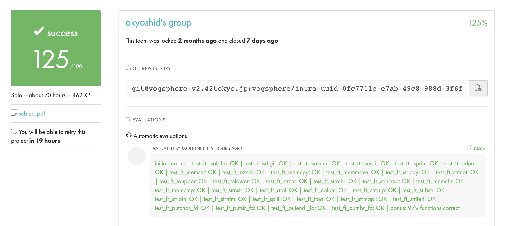

# libft

## 🤖 Evaluations by Moulinette

**My project page:** [Intra 42 - akyoshid's Libft](https://projects.intra.42.fr/42cursus-libft/mine)

## 🧪 Testers Used

Below are the testers I used for the libft project, along with their sources and results.

### 1️⃣ libftTester

- **Source:** [GitHub - Tripouille/libftTester](https://github.com/Tripouille/libftTester)
- **Result:** [Warp - libftTester](https://app.warp.dev/block/WL9DhQofir4IggDCHc9mGO)

### 2️⃣ libft-unit-test

- **Source:** [GitHub - alelievr/libft-unit-test](https://github.com/alelievr/libft-unit-test/tree/master)
- **Result:** [Warp - libft-unit-test](https://app.warp.dev/block/oWQekecXNQ4g57ADdnxAuN)

### 3️⃣ libft-tester-tokyo

- **Source:** [GitHub - usatie/libft-tester-tokyo](https://github.com/usatie/libft-tester-tokyo)
- **Results:**
  - [Warp - libft-tester-tokyo (Mandatory)](https://app.warp.dev/block/myTjPePoghxNZLzco7gnm8)
  - [Warp - libft-tester-tokyo (Bonus)](https://app.warp.dev/block/07KDHG4sI4q5Em6gkNMjEL)
